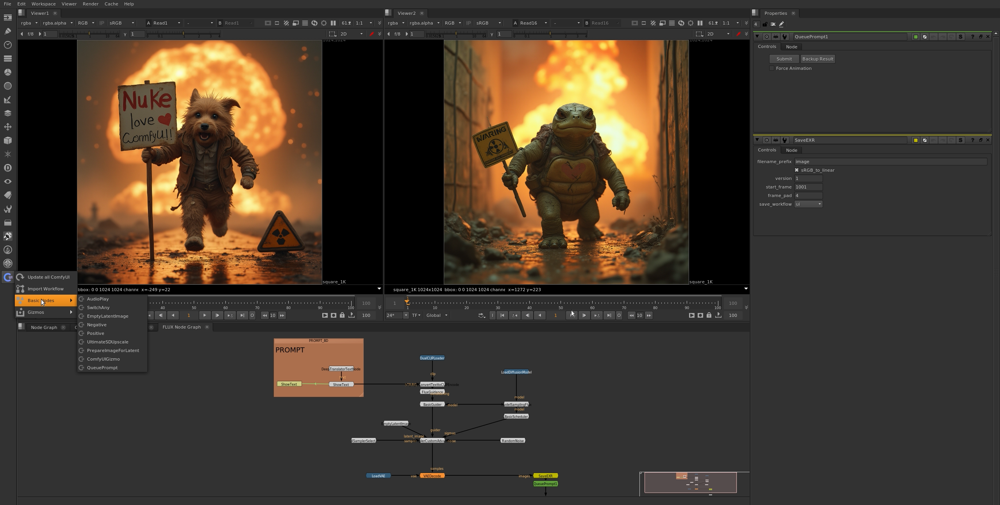
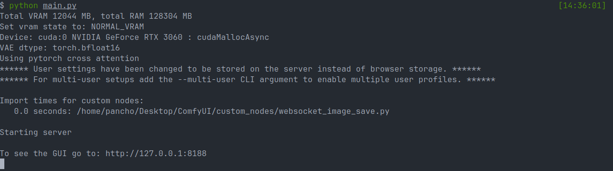

# ComfyUI for Nuke
API to be able to use ComfyUI nodes within nuke, only using the ComfyUI server

This is a fork of [@vinavfx/ComfyUI-for-Nuke](https://github.com/vinavfx/ComfyUI-for-Nuke) with changes that allow ComfyUI for Nuke to run on a Windows machine whilst connecting to ComfyUI on a remote Linux machine.

<div style="display: flex;">
  
</div>

## Requirements
  * Nuke 11 or higher (Not tested on previous versions !)
  * `websocket-client` Python library
  * <a href="https://github.com/comfyanonymous/ComfyUI" target="_blank">ComfyUI</a>
  * ComfyUI-HQ-Image-Save (required to load images and sequences and work with EXR)

## Installation
### 1. Copy to nuke folder
   ```sh
   # Linux:
   cd ~/.nuke
   git clone --recursive https://github.com/artandmath/ComfyUI-for-Nuke nuke_comfyui

   # Windows
   # Download git: https://git-scm.com/download/win
   cd "C:\Users\<username>\.nuke"
   git clone --recursive https://github.com/artandmath/ComfyUI-for-Nuke nuke_comfyui
   ```
Or manually copy the entire git downloaded folder and its submodules to the nuke user folder

### 2. Install `websocket-client` Python Library
`websocket-client` is a third-party library needed for the scripts to work correctly. [Here is a direct link to it's pypi installation](https://pypi.org/project/websocket-client/).

Choose one of the following methods:

#### Method A: Install to user .nuke directory
Install `websocket-client` directly to your Nuke user directory:
   ```bash
   # Install websocket-client to .nuke directory
   pip install websocket-client --target ~/.nuke/
   ```

#### Method B: Install and add to `NUKE_PATH`
Install `websocket-client` to a custom directory and add it to your `NUKE_PATH`:
   ```bash
   # Custom directory for Python modules
   pip install websocket-client --target /example/path/to/pythonlibs
   
   # Add to NUKE_PATH environment variable
   export NUKE_PATH="/example/path/to/pythonlibs:$NUKE_PATH"

   # Or add to NUKE_PATH via init.py
   nuke.pluginAddPath('/example/path/to/pythonlibs')
   ```

### 3. Copy these lines into <b>menu.py</b>

Add the following to your Nuke `menu.py` file:

```python
import nuke_comfyui as comfyui
comfyui.setup()
```

### 4. Install ComfyUI-Manager
```sh
cd <ComfyUI Directory>/custom_nodes
git clone https://github.com/ltdrdata/ComfyUI-Manager.git
cd ./ComfyUI-Manager
pip install -r requirements.txt
```

### 5. Install ComfyUI-HQ-Image-Save (required to work with EXR)
```sh
cd <ComfyUI Directory>/custom_nodes
git clone https://github.com/spacepxl/ComfyUI-HQ-Image-Save.git
cd ./ComfyUI-HQ-Image-Save
pip install -r requirements.txt
```

## Setup
1 - Run ComfyUI Server
```sh
cd <ComfyUI Directory>
python main.py
```


2 - Modify environment variables in [env.py](./env.py)

```python
dir_local  = 'U:/' # Local Windows path where ComfyUI directory is mounted/mapped
dir_remote = '/home/user/ComfyUI/' # Remote Linux path where ComfyUI is installed
ip = '192.168.1.123' # IP address of the remote ComfyUI server
port = 8188
nuke_user = get_nuke_path() # Automatically detected, change only if needed
```
Alternatively, you can set these environment variables instead of modifying env.py:
- `NUKE_COMFYUI_DIR_LOCAL` - Local Windows path where ComfyUI directory is mounted/mapped
- `NUKE_COMFYUI_DIR_REMOTE` - Remote Linux path where ComfyUI is installed  
- `NUKE_COMFYUI_IP` - IP address of the remote ComfyUI server
- `NUKE_COMFYUI_PORT` - Port number (default: 8188)
- `NUKE_COMFYUI_NUKE_USER` - Nuke user directory path (usually auto-detected)

## Tips
1 - When connecting any image or roto from Nuke, take into consideration the <b>'FrameRange'</b>
of the output because that will be the batch size.

2 - To make ComfyUI work with pixel values greater than 1 and less than 0, change tonemap knob to <b>'linear'</b> in the <b>'SaveEXR'</b> node

3 - Latent images only work with formats with multiple of 8, add the '<b>PrepareImageForLatent</b>' node before passing the image
to latent, and in the same node there is a button to create a restore node, put it on the image after inference to restore.

4 - To load all ComfyUI nodes when Nuke starts, change the '<b>update_menu_at_start</b>' variable in the [__init__.py](./__init__.py) file

5 - To use Switch on ComfyUI nodes use '<b>SwitchAny</b>' as ComfyUI switch nodes don't work
because they have 'any *' inputs and outputs, which is not possible on nuke because it doesn't have multiple outputs.

6 - To use ComfyUI server on another machine, set up the local and remote directory paths in [env.py](./env.py). The `dir_local` should be the Windows mapped drive where the remote ComfyUI directory is accessible, and `dir_remote` should be the actual path on the Linux machine where ComfyUI is installed.

7 - Use the Run '<b>Force Animation</b>' method only if you have some keyframes animated,
as this way is slower because it sends requests frame by frame and not in batches.

[SUPPORT THE MAINTENANCE OF THIS PROJECT](https://www.paypal.com/paypalme/ComfyUIforNuke)
